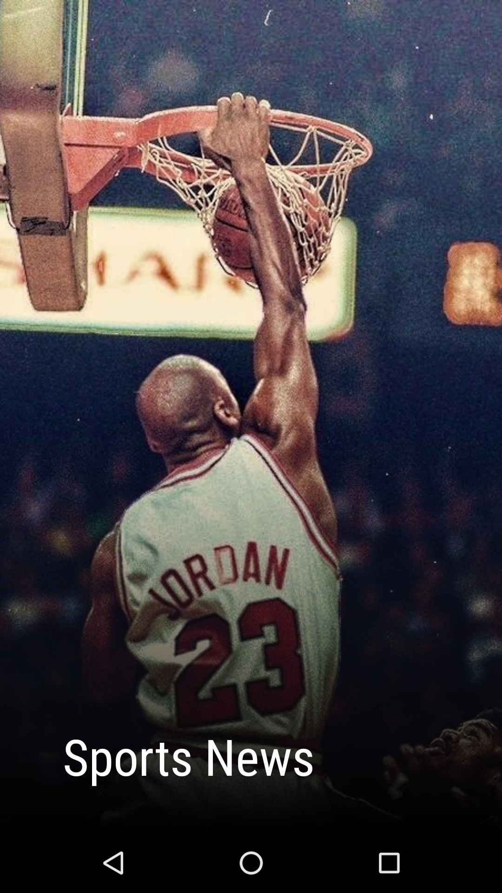
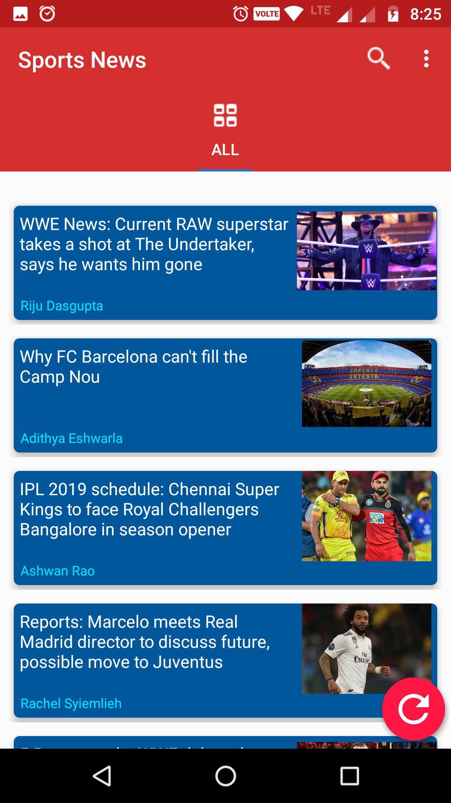
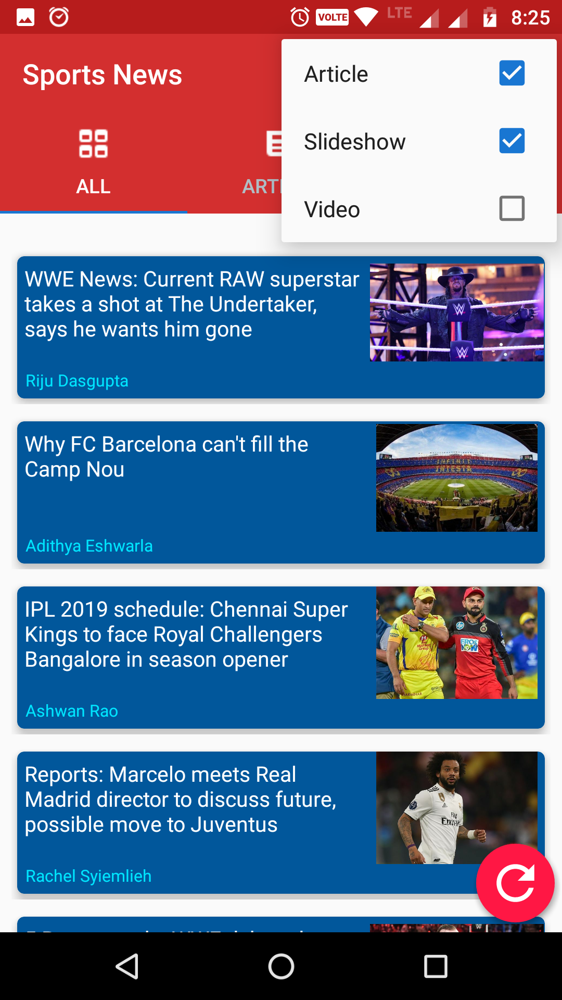
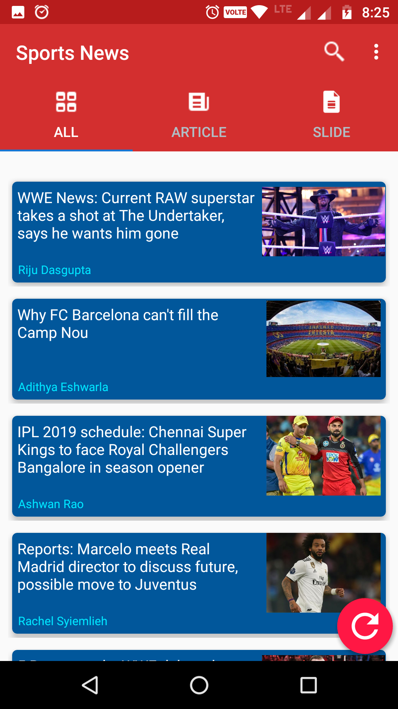

# Sports-News
A  Sports News application that uses Sportskeeda News API to fetch the News articles and display them in app. pressing the refresh button deletes the data fetches data again and stores it in realm database  or if we open application after sometime again it automatically shows us the updated news.
On clicking the news card, it opens the link of the news.

 
                        
 
